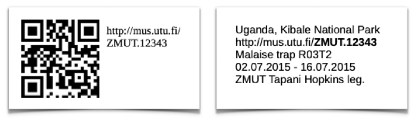

# wasps2kotka

R package for use at the [Zoological Museum of the University of Turku](https://collections.utu.fi/en/zoological-museum/). Helps database the wasps of the larger collections: 
- wasps collected by Malaise trapping in [Peru 1998-2011](https://doi.org/10.5281/zenodo.3559054)
- wasps collected by Malaise trapping in [Uganda 2014-2015](https://doi.org/10.5281/zenodo.2225643)
- wasps collected by canopy fogging in Ecuador
- wasps collected in Skanssi, Finland, in 2024

Takes the sample identifiers of the wasps, or the text of their labels. If given labels, extracts data from them. Figures out what sample the wasps came from, then creates a csv file for uploading the data to [Kotka](https://wiki.helsinki.fi/display/digit/Manual+for+Kotka) and [FinBIF](https://laji.fi/en). 

Typically used:

1. to upload new Ugandan or Skanssi wasps to the database. All that is needed are the sample IDs of each wasp.

2.  when faced with the daunting task of digitising thousands of already labelled tropical wasps, whose only information is on the labels. All that are needed are the label texts.

> 
>
> As a bonus, the package also has templates used to label the databased wasps. They are in folder "inst/label_templates" of the source code. 

> As a second bonus, the package also has a complete list of the samples collected in the Uganda 2014-2015, Peru 1998, Peru 2000, Peru 2008, Peru 2011, and Skanssi2024 collecting events. They are in folder "inst/extdata" as csv, and also load into R as variables `m` (basic data) and `m_kotka` (complete data).


## Installation

You can install the development version of wasps2kotka from [GitHub](https://github.com/) with:

``` r
# install.packages("devtools")
devtools::install_github("tapani-hopkins/wasps2kotka")
```

Alternatively, you can download the entire folder and install with:

``` r
install.packages("PATH_TO_FOLDER", repos=NULL, type="source")
```


## Usage

### Short version

``` r
# load the package
library(wasps2kotka)

# create upload for two wasps from Uganda and Skanssi
make_upload(c("cct1- 141022", "skanssiM3s2"))

# for labels, save as a data frame..
x = data.frame(label=c( "PERU 1.-15.12.2000, I1/17", "Tiputini 22. Oct 1998 Canopy fogging" ))

# .. then get data, verify it and create upload
make_upload(x)


```

### More detailed usage

Typically, you will have a list of label texts (Peru & Ecuador) or sample identifiers (Uganda, Skanssi). Something like this:

> PERU, Dept. of Loreto Iquitos area, Allpahuayo 1.-15.12.2000, white sand Sääksjärvi I.E et al. leg. Malaise trap, APHI, I1/17  
Hylesicida sp. ♂ 1st male Det. Ilari Sääksiärvi 2011  
ZMUT NEOT ICH 208

> ECUADOR, Dept. Orellana, Tiputini, 22. Oct 1998 00°37'55" S, 076°08'39" W, 220-250 m, Canopy fogging T.L. Erwin et al. Lot# 1966  
New gen. / Meniscomorpha sp. 2 ♂Det. Ilari Sääksiärvi 2011  
ZMUT NEOT ICH 209

> cct1- 141022

> skanssiM3s2

The job of this package is to go through all of these labels, and detect that:
- label 1 is from sample I1-17 and is a male
- label 2 is a canopy fogged male collected at Tiputini 22 October 1998
- label 3 is an Ugandan wasp from sample CCT1-141022
- label 4 is a Skanssi wasp from sample skanssiM3s2

.. and then pack all of the data (from labels and their associated samples) into a Kotka upload file.

To get this done, simply load the labels to R. You can e.g. save them in Excel, export as csv, then read them in to R with `read.csv`.

``` r
labels = read.csv("/path/to/labelfile.csv", as.is=TRUE)
```

Easiest is to name the column that has labels "label". This column name is recognised automatically by the script. You can also give additional data in the following columns:
- `box` Added to the equivalent column in Kotka, "MYDocumentLocation".
- `date_begin` Start date in format "04.12.1998".
- `date_end` End date in format "04.12.1998".
- `sample` Sample identifier. If the labels give a different sample to this, this is the sample whose data will be added to Kotka.
- `sex` One of "F", "M" or "U". If the sex given by labels contradicts this, this is the one which will be added to Kotka.

Then can make an upload file:

``` r
# load the package
library(wasps2kotka)

# example labels
labels = c(  
"PERU, Allpahuayo 1.-15.12.2000, Sääksjärvi I.E I1/17 Occia sp. 1. ♀ ",  
"ECUADOR, Tiputini, 22. Oct 1998, Canopy fogging Lot# 1966 Meniscomorpha sp. 2"  , 
"cct1-141022",
"skanssim3s2"
)

# example data on sex (wasp 2 is female)
sex = c(NA, "F", NA, NA)

# save labels and other data as data frame
x = data.frame(label=labels, sex=sex)

# create a Kotka upload file for these wasps
make_upload(x)
```

This results in a file (kotka_upload.csv) with all the data on the wasps in the format expected by Kotka. 

Before uploading to Kotka, open the file in e.g. Excel, and fill in any fields which are still missing. E.g. specimen ID and species name will typically need filling in. 

Then save as Excel or csv, and upload the file to Kotka. 

